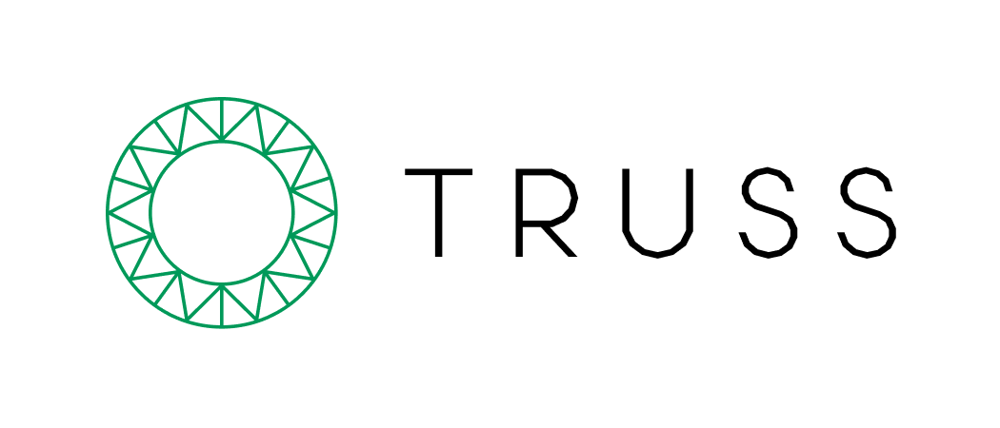

# Truss

**Serve any model without boilerplate code**



Meet Truss, a seamless bridge from model development to model delivery. Truss presents an open-source standard for packaging models built in any framework for sharing and deployment in any environment, local or production.

## Quickstart

Generate and serve predictions from a Truss with [this Jupyter notebook]().

```
!pip install scikit-learn
!pip install truss
import truss
from sklearn.ensemble import RandomForestClassifier
from sklearn.datasets import load_iris

iris = load_iris()
data_x = iris['data']
data_y = iris['target']
rfc = RandomForestClassifier()
rfc.fit(data_x, data_y)

truss.mk_truss(rfc, target_directory="iris_rfc")
# TRUSS PREDICT
```

## Use cases

Truss exposes just the right amount of complexity around things like Docker and APIs without you really having to think about them. Here's some of the things Truss does:

* 🏎 Turns your Python model into a microservice with a production-ready API endpoint, no need for Flask or Django.
* 🎚 For most popular frameworks, includes automatic model serialization and deserialization.
* 🛍 Freezes dependencies via Docker to make your training environment portable.
* 🕰 Enables rapid iteration with local development that matches your production environment.
* 🗃 Encourages shipping parsing and even business logic alongside your model with integrated pre- and post-processing functions.
* 🤖 Supports running predictions on GPUs. (Currently limited to certain hardware, more coming soon)
* 🙉 Bundles secret management to securely give your model access to API keys.

### Model as an API

Truss turns your ML model into a backend for web, no Django or Flask needed. This "model as a microservice" approach saves time writing and maintaining web server code, and makes the model a single unit within your application.

Every model runs in its own environment. This is a different intuition than most APIs, where endpoints share the same dependencies and resources. But two different machine learning models might depend on different frameworks, packages, and hardware. So Truss keeps everything separate, preventing tangled configurations or repeated model serving work.

And with your model behind an API, you can do end-to-end tests locally with your front-end or other systems. Turning a Python-first object into a web-first object unlocks workflows for all kinds of software developers.

### Model as a sharable artifact

Running a model that someone else has created is non-trivial. Sometimes it even requires re-creating their training environment and training it yourself, but at minimum requires setting up an environment, deserializing the model, and creating a model server.

With Truss, "a model exists" and "I can run the model on any machine" are equivalent statements. Truss reliably packages models to be ready for the web and any other ways people want to interface with it. Package your model as a Truss and share it within your team or with the world, and the "setup" portion of your README will be shorter than ever.

### Model as a component

A model embedding factorizes inputs to make them understandable to a model. This is a form of pre-processing input. But pre- and post-processing can be more powerful and flexible. So Truss bundles these functions in the `model.py` file. By writing custom pre- and post-processing code, you can make your model a drop-in component to a larger system and use the same formats to pass around information, be that JSON, XML, video, natural language, or any other structured or unstructured data.

Over time, we aim to add features for iterative development, helping with detecting anomalies, drift, and more. And by composing multiple models, each with their own Truss, you'll be able to build more powerful, capable systems with just a few lines of pre- and post-processing code, conveniently bundled with your model. Truss' use cases are expanding quickly, and you can [review and contribute to the roadmap here]().

## Installation

Truss requires Python >= 3.7,<3.11

To install from [PyPi](https://pypi.org/project/truss/), run:

```
pip install truss
```

To download the source code directly (for development), clone this repository and follow the setup commands in our [contributors' guide](CONTRIBUTING.md).

Truss is actively developed, and we recommend using the latest version. To update your Truss installation, run:

```
pip install --upgrade truss
```

Though Truss is in beta, we do care about backward compatibility. Review the [release notes](docs/CHANGELOG.md) before upgrading, and note that we follow semantic versioning, so any breaking changes require the release of a new major version.

## Our vision for Truss

Data scientists and machine learning engineers spend a lot of time building models that solve specific problems: sentiment classification, facial recognition, anomaly detection. Generally, this exploratory, experimental work is done using an interactive environment like a Jupyter notebook. To match the wide variety of use cases for ML models, there are a number of popular frameworks to build in, like PyTorch, TensorFlow, and scikit-learn. Each framework specializes in different kinds of models, so a data scientist will pick the framework based on the type of problem they are solving.

As such, the data scientist's development environment needs to be flexible and permissive. Jupyter notebooks are a great tool for training models, but as a impermanent and development-oriented environment they aren't great for model serving. Model serving, or making a model available to other systems, is critical; a model is not very useful unless it can operate in the real world.

There are many ways to serve a model, but most involve the following steps in some form:

1. Serialize the model
2. Put the model behind a web server such as Flask
3. Package the web server into a Docker image
4. Run the Docker image on a container

DevOps is its own specialty for a reason: the endless configuration options and compatibility checks throughout this process can be overwhelming. So Data Scientists, if they're lucky, are able to turn to infrastructure teams for help. But this is not an ideal solution:

* Data scientists compete for the limited bandwidth of infrastructure teams, leading to long wait times to get models deployed.
* The cost and friction of accessing infrastructure expertise means that only the safest ideas ever see the light of day. A lot of brilliant models may not seem promising at first, and will die in the backlog before reaching their potential.
* Debugging is hard when the model serving environment is different from the data scientist's notebook, introducing cumbersome and time-consuming effort to get everything set up right.

Truss bridges the gap between model development and model deployment by making it equally straightforward to serve a model in localhost and in prod, making development and testing loops rapid.

We built and open-sourced Truss with the conviction that eliminating this friction will accelerate machine learning productivity:

* Data scientists can build or deploy Docker images with a single command, reducing the model serving workload.
* Models can be packaged in a standardized format, making it easier to share models within or beyond a team.
* Data scientists can build on each other's work by pulling down popular models without spending hours coaxing them into running in a new environment.
* Providing a web-first interface for models will encourage real-world use and new applications.

## Contributing

We hope this vision excites you, and we gratefully welcome contributions in accordance with our [contributors' guide](CONTRIBUTING.md) and [code of conduct](CODE_OF_CONDUCT.md).

Truss was first developed at [Baseten](https://baseten.co) by maintainers Phil Howes, Pankaj Gupta, and Alex Gillmor.
