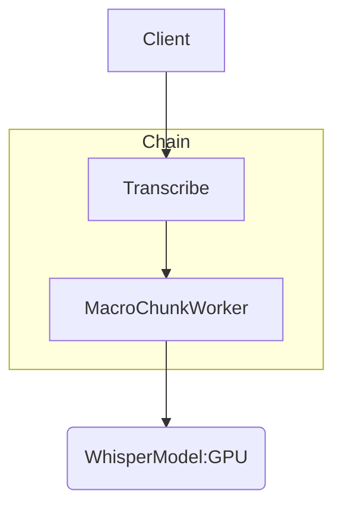

<Warning>*Chains* is a beta feature and subject to breaking changes.</Warning>

import TOC from '/snippets/chains/TOC.mdx';

<TOC />

# Overview

This example shows how to transcribe audio media files to text blazingly fast
and at high quality using a *chain*. To achieve this we will combine a
number of methods:

* Partitioning large input files (10h+) into smaller chunks.
* Analyzing the audio for silence to find optimal split points of the chunks.
* Distributing the chunks tasks across auto-scaling baseten deployments.
* Using batching with a highly optimized transcription model to maximize
  GPU utilization.
* Range downloads and pipelining of audio extraction to minimize latency.
* `asyncio` for concurrent execution of tasks.

The implementation is quite a bit of code, located in the
[chains examples repo](https://github.com/basetenlabs/truss/tree/main/truss-chains/examples/transcribe).
this guide is a commentary on the code, pointing out critical parts or
explaining design choices.

If you want to try out this chain and create a customized version of it,
copy the example directory `truss-chains/examples/transcribe` into your dev
environment and start modifying the code.

# The Chain

### Structure



The actual chunking is a bit more complicated, since it is a 2-step hierarchy:
* "macro chunks" in the range of ~300s. These are downloaded, for large
  files this facilitates parallel downloads, for small files
  there will be only a single "macro chunk".
* "micro chunks" in the range of 5-30s, these are sent to the transcription
  model.

More details in the explanations of the chainlets below.

<Tip>
The `WhisperModel` is split off the transcription chain. This is
optional, but has some advantages:
* A lot of "business logic", which might more frequently be changed, is
  implemented in the chain. When developing or changing the chain and making
  frequent re-deployments, it's a faster dev loop to not re-deploy the
  Whisper model, since as a large GPU model with heavy dependencies, this is
  slower.
* The Whisper model can be used in other chains, or standalone, if it's not
  part of this chain. Specifically the same model can be used by dev and
  prod version of a chain - otherwise a separate Whisper model would need to
  be deploye with each environment.
* When making changes and improvements to the Whisper model, the development
can be split of the development of the chain - think of a seperation of
concerns into high-level (the chain) and low-level (the model) development.

More information on how to use and deploy non-chain models within a chain is
given in the [WhisperModel section](#whispermodel) below.
</Tip>

### `Transcribe`

This chainlet is the "entrypoint" to the chain, external client send
transcription requests to it. It's endpoint implementation has the following
signature:

```python
async def run_remote(
  self,
  job_descr: data_types.JobDescriptor,
  params: data_types.TranscribeParams
) -> data_types.Result:
```

The input arguments are separated into `job_descr`, the data to work on, and
`params` that control the execution, e.g. the chunk sizes. You can find the
exact schemas and docstrings of these arguments in
[data_types.py](https://github.com/basetenlabs/truss/blob/main/truss-chains/examples/transcribe/data_types.py).
An example request looks like this:


```bash
curl -X POST 'https://model<MODEL_ID>.api.baseten.co/development/predict' \
    -H "Authorization: Api-Key $BASETEN_API_KEY" \
    -d '<JSON_INPUT>'
```

with JSON input:

```json
{
  "job_descr": {
    "media_url": "http://commondatastorage.googleapis.com/gtv-videos-bucket/sample/TearsOfSteel.mp4",
    "job_uuid": "3bcbfb53-0ffa-445e-824d-15012f5221db"
  },
  "params": {
    "micro_chunk_size_sec": 30
  }
}
```

The output looks like this (truncated):

```json
{
    "job_descr": {
        "media_url": "http://commondatastorage.googleapis.com/gtv-videos-bucket/sample/TearsOfSteel.mp4",
        "job_uuid": "job_uuid_0",
        "media_id": 0,
        "status": "SUCCEEDED"
    },
    "segments": [
        ...
        {
            "start_time_sec": 517.9465,
            "end_time_sec": 547.70975,
            "text": "The world's changed, Celia. Maybe we can too. Memory override complete!",
            "language": "english",
            "bcp47_key": "en"
        },
        {
            "start_time_sec": 547.70975,
            "end_time_sec": 567.0716874999999,
            "text": "You know, there's a lesson to be learned from this. Could've gone worse.",
            "language": "english",
            "bcp47_key": "en"
        },
        ...
    ],
    "input_duration_sec": 734.261406,
    "processing_duration_sec": 82.42135119438171,
    "speedup": 8.908631020478238
}
```

The `Transcribe` chainlet does the following:
* Assert that the media URL supports range downloads. This is usually a given
  for video / audio hosting services.
* Uses `FFMPEG` to query the length of the medium (both video and audio
  files are supported).
* Generates a list of "macro chunks", defined by their start and end times.
  The length is defined by `macro_chunk_size_sec` in `TranscribeParams`.
  TODO: this will soon be upgraded to find silence aware split points, so
  that a chunk does not end in the middle of a spoken word. To do this a
  small segment around the desired chunk boundary is downloaded (e.g. +/- 5
  seconds) and the most silent timestamp within is determined.
* Sends the media URL with chunk limits as "tasks" to `MacroChunkWorker`. Using
  `asyncio.ensure_future`, these tasks are dispatched concurrently - meaning
  that the loop over the chunks does not wait for each chunk to complete first,
  before dispatched the task on the next chunk. These "calls" are network
  requests (RPCs) to the `MacroChunkWorker` chainlet which runs on its own
  deployment and can auto-scale, depending on the load.
* Once all tasks are dispatched, it waits for the results and concatenates
  all the partial transcriptions from the chunks to a final output.

### `MacroChunkWorker`

The `MacroChunkWorker` chainlet works on chunk tasks it receives from the
`Transcribe` chainlet. For each chunk it does the following:

* It starts a `DownloadSubprocess` asynchronously (i.e. this will need CPU on
  the machine, but not block the event loop of the main process, making it
  possible to serve multiple concurrent requests).
* In the download subprocess, `FFMPEG` downloads the relevant time range from
  the source file, extracts audio wave form and streams the raw wave
  `bytes` back to the main process. This happens on-the-fly (i.e. not waiting
  for the full download to complete) - so the initial latency until
  receiving wave bytes is minimized.
* Furthermore, it resamples the wave form to the sampling rate expected by the
  transcription model and averages multichannel audio to a mono signal.
* One detail is that when streaming the wave bytes to the main
  process, we need to intercept the wave metadata from the header. There is
  a function in `helpers.py` for this: `_extract_wav_info`.
* Quite a lot of case distinctions and logging is done for error handling and
  resource cleanup in case of failures, e.g. in the exiting of the
  `DownloadSubprocess`-context.
* The main process reads as many bytes from the wave stream as needed for
  `micro_chunk_size_sec` (5-30s). The byte size is linked to the time by the
  sampling rate and numeric type of the wave data.
* A helper function `_find_silent_split_point` analyzes the wave form to
  find the most silent point in the *second half* of the chunk. E.g. if the
  `micro_chunk_size_sec` is 5s, then it searches the most silent point
  between 2.5 and 5.0s and uses this time to cut the chunk.
* The wave bytes are converted to  wave file format (i.e. including metadata
  in the header) and then b64-encoded so they can be sent as JSON via HTTP.
* For each b64-encoded wave audio "micro" chunk, the transcription model is
  invoked.
* Like in the `Transcribe` chainlet, these tasks are concurrent RPCs, the
  transcription model can scale with the load.
* Finally, we wait for all "micro chunk" results, concatenate them to a
* "macro chunk" result and return it to `Transcribe`.

### `WhisperModel`

As mentioned in the [structure section](#structure), the `WhisperModel` is
separately deployed from the transcription chain.

In the chain implementation we only need to define a small "adapter" class
`WhisperModel`, mainly for integrating the I/O types of that model with our
chain. This is a subclass of `chains. StubBase` which abstracts sending
requests, retries etc. away from us (this class is also used for all RPCs that
the chains framework makes internally). Furthermore, we need to take the
invocation URL of that model (e.g.
`https://model-5woz91z3.api.baseten.co/production/predict`) and pass it
along when initializing this adapter class with the `from_url` factory-method.

There are two options for deploying a model separately from a chain:

#### As a Chainlet

(not done in this example)

As a chainlet it could even be in the same file, but not "wired" into the chain
with the `chains.depends`-directive.
* It will not be included when running the `truss chains deploy` command for
  the entrypoint, since it's not formally a tracked dependency.
* It is deployed using the deploy command specifically selecting that
  class e.g. `truss chains deploy <FILE> SeparateModelChainlet` - which in turn
  will only deploy that model and not anything else of the chain.
* Having the chainlet separately deployed, but in the same file, has the
  advantage of more code-coherent because everything is on one place, while
  still allowing independent deployment and dev cycles.

#### As a conventional Truss Model

(done in this example)

This could be anything, from the
[model library](https://www.baseten.co/library/), the
[truss examples repo](https://github.com/basetenlabs/truss-examples) or your
[own truss model](https://truss.baseten.co/quickstart).

This might be the better choice, if the model has a substantial code base
itself and if you want to avoid mixing that (and the development of it) with
the chain code.

# Performance Considerations

Even for very large files, e.g. 10h+, the end-to-end runtime is still bounded:
since the `macro_chunk_size_sec` is fixed, each sub-task has a
bounded runtime.
So provided all chainlet components have enough resources
to auto-scale horizontally and the network bandwidth of the source hosting is
sufficient, the overall runtime is still relatively small. Note that
auto-scaling, e.g. the transcription model, to a large number of replicas can
take a while, so you'll only see the full speedup after a "warm-up" phase.

Depending on distribution of your input durations and the "spikiness" of
your traffic there are a few knobs to tweak:
* `micro_chunk_size_sec`: using too small "micro" chunks creates more
  overhead and leaves GPU underutilized, using too large ones, they
  processing of a single chunk might take too long or overflow the GPU model
  -- the sweet spot is in the middle.
* `macro_chunk_size_sec`: larger chunks mean less overhead, but also less
  download paralellism.
* Predict-concurrency and autoscaling settings of all deployed components.
  Specifically make sure that the WhisperModel can scale up to enough
  replicas (but should also not be underutilized). Look at the GPU and CPU
  utilization metrics of the deployments.
