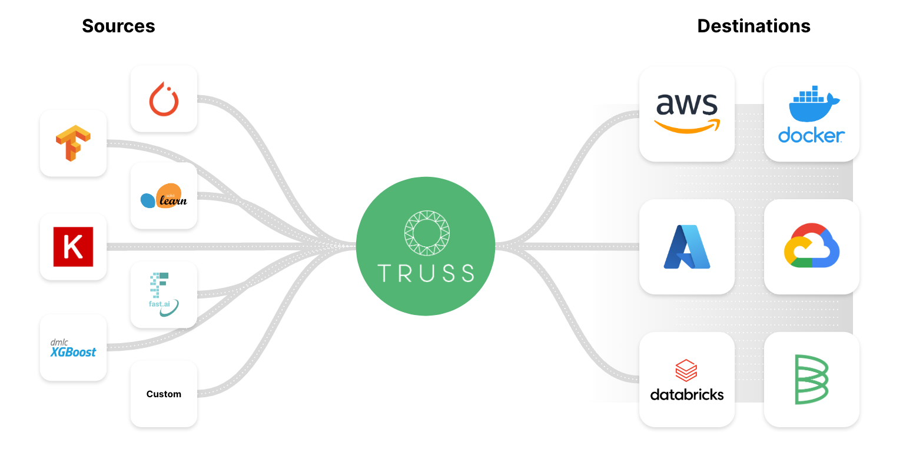

# End-to-end model tutorial

Model deployment works in three stages:

1. Package your model into a Truss
2. Configure the Truss to serve your model
3. Deploy the Truss, containing your packaged model, on the platform of your choice



If you want to explore Truss end-to-end before using it for your own projects, follow along using [this notebook for deploying a Tensorflow model on AWS ECS](), which you can run locally or on Google Colab.

## Step 0: Build your model

Truss is useful after you have a trained machine learning model that you are happy with and want to deploy. You can build a Truss from a pickled or otherwise saved model, or from an in-memory model. So to follow this guide, you will need **one** of the following:

* An in-memory machine learning model (most useful for supported frameworks listed below), or
* A serialized model, or
* A script to download, create, or otherwise generate one of the previous options


If you want to follow this tutorial for a particular framework and don't have a model, no worries! Each of the Truss creation tutorials linked in step 1 features sample code for a ML model in the appropriate framework.


## Step 1: Create a Truss

Truss works across model frameworks, and the most common model frameworks are supported with the one-line `mk_truss` command. Click the framework you built your model in to see specific packaging instructions for that format.

For the following formats, if you have an in-memory trained model object `model`, just call the following:

```python
from truss import mk_truss

mk_truss(model, target_directory="my_truss")
```

Supported frameworks:

* [Hugging Face](create/huggingface.md)
* [PyTorch](create/pytorch.md)
* [scikit-learn](create/sklearn.md)
* [Tensorflow](create/tensorflow.md)

The following frameworks will soon be supported by the `mk_truss` command and in the meantime can be created manually:

* [XGBoost](create/xgboost.md)
* [LightGBM](create/manual.md)

A model built in framework not listed, or built without a framework, can still be packaged and used as a Truss. You'll just need to [build the Truss manually](create/manual.md).

## Step 2: Local development and testing

For an in-depth guide to Truss configuration, see [Truss for model development](model-evaluation.md).

In the most straightforward cases, you can skip this step entirely. For example, the Truss created from the [scikit-learn tutorial model](create/sklearn.md), a simple random forest classifier on the Iris data set, is ready to deploy as-is. For more complex use cases, some configuration is required, but don't worry, we're not dropping you off the deep end to do your own MLOps. Truss configuration should take little time and use familiar tools.

Before deploying your model in its Truss, try [serving it locally](develop/localhost.md) to make sure everything is working as expected. If not, work through the following brief configuration guides as needed:

* [Pre- and post-processing on model invocation](develop/processing.md)
* [Preparing sample inputs](develop/examples.md)
* [Configuring the Truss](develop/configuration.md)
* [Adding GPU support](develop/gpu.md)
* [Managing secrets and passwords](develop/secrets.md)

## Step 3: Deploy your model

You can deploy a Truss anywhere that can run a Docker image, as well as purpose-built platforms like [Baseten](https://baseten.co).

Once your Truss is configured, it doesn't matter what framework your model was written in, only that you are deploying to a platform that can provision the resources your model needs. We have step-by-step deployment guides for the following platforms:

* [AWS ECS](deploy/aws.md)
* [Baseten](deploy/baseten.md)
* [Docker on bare metal](deploy/docker.md)
* [GCP Cloud Run](deploy/gcp.md)
